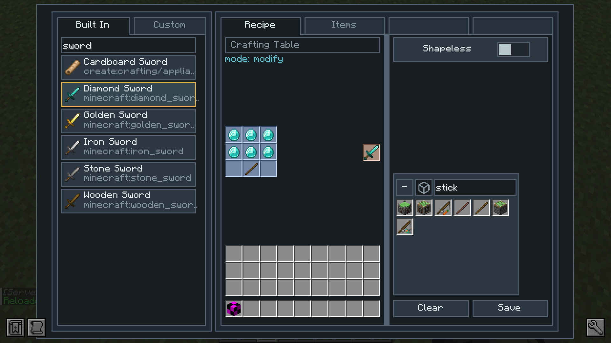
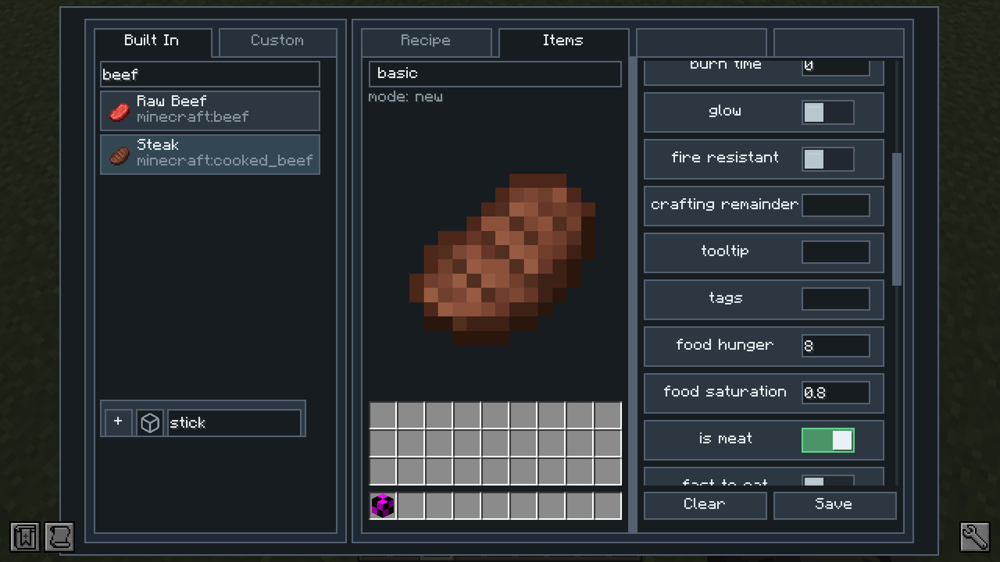

# KubeJS Lab

KubeJS Lab is an addon for KubeJS that gives KubeJS a face. It started because I got sick of writing the same JSON or JS files over and over again, so I built an in-game GUI for the things.No scripts and no manual JSON or JS editing.

## Screenshots

## Features

### Recipe Tab
The recipe editor for vanilla and modded machines.
- Create, modify, disable, and delete recipes without touching a single JSON or JS file
- Tune everything from a game UI: experience, cooking and processing times, energy (FE), fluid amounts (mB), heat requirements, chances, mirrored patterns, and grid sizes

### Item Tab
Create, change, and remove items without touching JSON or JS.
- Create brand-new items: basic items, tools, armor, and music discs
- Modify any existing item — display name, texture, rarity, stack size, durability, fuel value, fire resistance, tooltip lines, tags, and more
- Full food properties: hunger, saturation, meat, fast eating, and effects with durations, amplifiers, and chances
- Tool and armor tiers with durability, mining speed, damage, enchantability, repair ingredients, protection, toughness, and knockback resistance
- Attributes and modifiers for stats like health, and right-click behaviors that give items or deal durability damage
- Disable items: hide from creative, remove their recipes, or hide them from recipe viewers like JEI

## Integrations

### Fabric
- Built-in support for vanilla machines: crafting (shaped and shapeless), furnace, blast furnace, smoker, campfire, smithing, and stonecutting
- Full **Create** machine support: mixing, pressing, compacting, milling, crushing, sawing, deploying, item application, mechanical crafting, block cutting, fan smoker and blasting, draining, spout filling, and more

### Forge
- Built-in support for vanilla machines: crafting (shaped and shapeless), furnace, blast furnace, smoker, campfire, smithing, and stonecutting
- Full **Create** machine support: mixing, pressing, compacting, milling, crushing, sawing, deploying, item application, mechanical crafting, block cutting, fan smoker and blasting, draining, spout filling, and more
- Full **Immersive Engineering** machine support: metal press, arc furnace, alloy smelter, blast furnace, coke oven, crusher, fermenter, sawmill, mixer, refinery, bottling, cloche, water wheel, and blueprint crafting

## Dependencies

- Forge: KubeJS, LDLib, Architectury, Rhino, and JEI
- Fabric: KubeJS, LDLib, Architectury, Rhino, JEI, and Fabric API
- Optional: Create 6.0.8, Immersive Engineering 10.2.0

## TODO

- write public docs and record some tutorial videos

## SOME NOTES

- My mods and texture packs are officially published **only** on Modrinth. Since this mod is licensed under the MIT License, you may also see reuploads elsewhere, so please download only from sources you trust and be careful with random files.

- An AI coding agent was used during development. Just putting it out there for transparency. If that bothers you, that is completely fine use it, avoid it, ignore it or simply do what you want with it. It is up to you.

## License

Spoiler

MIT License

Copyright (c) 2025 ABO47

Permission is hereby granted, free of charge, to any person obtaining a copy
of this software and associated documentation files (the "Software"), to deal
in the Software without restriction, including without limitation the rights
to use, copy, modify, merge, publish, distribute, sublicense, and/or sell
copies of the Software, and to permit persons to whom the Software is
furnished to do so, subject to the following conditions:

The above copyright notice and this permission notice shall be included in all
copies or substantial portions of the Software.

THE SOFTWARE IS PROVIDED "AS IS", WITHOUT WARRANTY OF ANY KIND, EXPRESS OR
IMPLIED, INCLUDING BUT NOT LIMITED TO THE WARRANTIES OF MERCHANTABILITY,
FITNESS FOR A PARTICULAR PURPOSE AND NONINFRINGEMENT. IN NO EVENT SHALL THE
AUTHORS OR COPYRIGHT HOLDERS BE LIABLE FOR ANY CLAIM, DAMAGES OR OTHER
LIABILITY, WHETHER IN AN ACTION OF CONTRACT, TORT OR OTHERWISE, ARISING FROM,
OUT OF OR IN CONNECTION WITH THE SOFTWARE OR THE USE OR OTHER DEALINGS IN THE
SOFTWARE.

## THIRD PARTY LICENSES

Spoiler

Copyright (c) 2026 Lucide Icons and Contributors

Permission to use, copy, modify, and/or distribute this software for any purpose with or without fee is hereby granted, provided that the above copyright notice and this permission notice appear in all copies.

THE SOFTWARE IS PROVIDED "AS IS" AND THE AUTHOR DISCLAIMS ALL WARRANTIES WITH REGARD TO THIS SOFTWARE INCLUDING ALL IMPLIED WARRANTIES OF MERCHANTABILITY AND FITNESS. IN NO EVENT SHALL THE AUTHOR BE LIABLE FOR ANY SPECIAL, DIRECT, INDIRECT, OR CONSEQUENTIAL DAMAGES OR ANY DAMAGES WHATSOEVER RESULTING FROM LOSS OF USE, DATA OR PROFITS, WHETHER IN AN ACTION OF CONTRACT, NEGLIGENCE OR OTHER TORTIOUS ACTION, ARISING OUT OF OR IN CONNECTION WITH THE USE OR PERFORMANCE OF THIS SOFTWARE.

